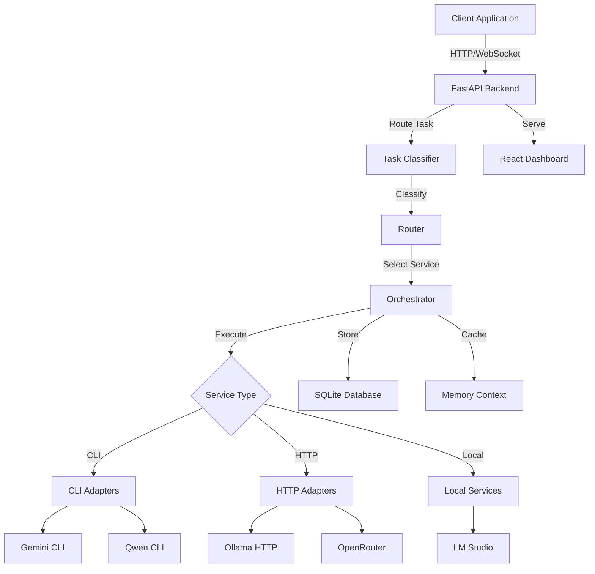

# Architecture Overview

Oxide is built as a modular, scalable LLM orchestration platform designed for intelligent routing and management of multiple LLM providers.

## System Components

### Core Architecture



## Component Breakdown

### 1. **FastAPI Backend** (`src/oxide/web/backend/`)

The API server that handles all incoming requests:
- **REST API**: CRUD operations for tasks, services, and configuration
- **WebSocket**: Real-time updates for task execution and metrics
- **Static Serving**: Serves the built React frontend

**Key Files:**
- `main.py` - Application entry point
- `routes/` - API endpoint definitions
- `websocket.py` - WebSocket connection management

### 2. **Task Classifier** (`src/oxide/core/classifier.py`)

Analyzes incoming tasks to determine their characteristics:
- **Task Type Detection**: Question answering, code generation, summarization, etc.
- **Complexity Analysis**: Token count, context requirements
- **Priority Assignment**: Urgent, high, normal, low

**Classification Algorithm:**
```python
def classify_task(prompt: str, files: List[str]) -> TaskClassification:
    # 1. Analyze prompt keywords
    task_type = detect_task_type(prompt)

    # 2. Calculate complexity
    token_count = count_tokens(prompt)
    file_count = len(files)

    # 3. Determine priority
    priority = calculate_priority(task_type, token_count)

    return TaskClassification(
        task_type=task_type,
        priority=priority,
        estimated_tokens=token_count
    )
```

### 3. **Router** (`src/oxide/core/router.py`)

Selects the optimal service for each task:
- **Rule-Based Routing**: Uses custom routing rules from configuration
- **Capability Matching**: Matches task requirements with service capabilities
- **Load Balancing**: Distributes tasks across healthy services
- **Fallback Logic**: Automatic failover to alternative services

**Routing Decision Flow:**
1. Check custom routing rules for task type
2. Filter services by health status
3. Score services based on capability match
4. Select highest-scoring available service
5. Fall back to next best if primary fails

### 4. **Orchestrator** (`src/oxide/core/orchestrator.py`)

Manages task execution across multiple services:
- **Execution Coordination**: Coordinates task execution flow
- **Context Management**: Maintains conversation context
- **Result Aggregation**: Collects and formats results
- **Error Handling**: Robust error recovery and retry logic

**Execution Flow:**
```python
async def execute_task(task: Task) -> TaskResult:
    # 1. Classify task
    classification = classifier.classify(task)

    # 2. Route to service
    service = router.select_service(classification)

    # 3. Execute with context
    context = memory.get_context(task.session_id)
    result = await service.execute(task, context)

    # 4. Store result
    storage.save_task(task, result)
    memory.update_context(task.session_id, result)

    return result
```

### 5. **Service Adapters** (`src/oxide/adapters/`)

Abstraction layer for different LLM service types:

#### **CLI Adapters** (`cli_adapter.py`)
- Executes command-line tools like Gemini and Qwen
- Process management and output capture
- Automatic retry on failure

#### **HTTP Adapters** (`http_adapter.py`)
- REST API calls to services like Ollama and OpenRouter
- Connection pooling and timeout management
- SSE (Server-Sent Events) streaming support

**Adapter Interface:**
```python
class BaseLLMAdapter:
    async def execute(self, prompt: str, **kwargs) -> str:
        """Execute LLM request and return response"""
        pass

    async def health_check(self) -> bool:
        """Check if service is healthy"""
        pass

    async def get_info(self) -> Dict:
        """Get service information"""
        pass
```

### 6. **Storage Layer** (`src/oxide/utils/`)

#### **SQLite Database** (`storage.py`)
- Task history with execution metrics
- Service health logs
- Configuration persistence

**Schema:**
```sql
CREATE TABLE tasks (
    id TEXT PRIMARY KEY,
    prompt TEXT NOT NULL,
    task_type TEXT,
    service TEXT,
    status TEXT,
    result TEXT,
    tokens_used INTEGER,
    cost REAL,
    created_at REAL,
    completed_at REAL
);

CREATE INDEX idx_tasks_created ON tasks(created_at);
CREATE INDEX idx_tasks_service ON tasks(service);
```

#### **Context Memory** (`context_memory.py`)
- Conversation history management
- Vector-based semantic search
- Automatic context pruning

### 7. **React Dashboard** (`src/oxide/web/frontend/`)

Modern UI for monitoring and management:
- **Real-time Metrics**: CPU, memory, task execution
- **Service Health Matrix**: Visual service status
- **Task Executor**: Direct task submission
- **Configuration Panel**: Live configuration editing
- **Task History**: Complete execution logs

**State Management:**
- Zustand for global state
- Custom hooks for API integration
- WebSocket for real-time updates

## Data Flow

### Task Execution Flow

```
1. Client Request
   ↓
2. FastAPI Endpoint (/api/tasks/execute/)
   ↓
3. Task Validation
   ↓
4. Classification (task_type, priority, complexity)
   ↓
5. Routing Decision (select best service)
   ↓
6. Context Retrieval (get conversation history)
   ↓
7. Service Execution (via adapter)
   ↓
8. Result Processing
   ↓
9. Storage (SQLite + Context Memory)
   ↓
10. WebSocket Broadcast (notify clients)
    ↓
11. HTTP Response (return result)
```

### Real-time Updates Flow

```
1. Client Connects to WebSocket (/ws)
   ↓
2. Subscribe to Topics (metrics, tasks, services)
   ↓
3. Backend Events:
   - Task status change
   - Service health change
   - System metrics update
   ↓
4. Broadcast to Connected Clients
   ↓
5. Client Updates UI Reactively
```

## Scalability & Performance

### Horizontal Scaling

Oxide supports multi-instance deployment:
- **Shared Database**: All instances use same SQLite database
- **Stateless Backend**: No session state in memory
- **Load Balancer**: Distribute requests across instances

### Caching Strategy

- **Service Health**: 30-second cache for health checks
- **Configuration**: In-memory cache with hot-reload
- **Context Memory**: LRU cache for recent conversations

### Performance Optimizations

1. **Async I/O**: All network operations are async
2. **Connection Pooling**: Reuse HTTP connections
3. **Batch Processing**: Group multiple tasks when possible
4. **Lazy Loading**: Load services on-demand

## Security Architecture

### Authentication & Authorization

- **JWT Tokens**: Secure API access
- **API Keys**: Per-service authentication
- **Rate Limiting**: Prevent abuse
- **CORS**: Configurable cross-origin policies

### Data Protection

- **Environment Variables**: Sensitive config in env vars
- **Encrypted Storage**: API keys encrypted at rest
- **Secure Communication**: HTTPS for production
- **Input Validation**: Sanitize all user inputs

## Extension Points

### Adding New Services

```python
# 1. Create adapter
class NewServiceAdapter(BaseLLMAdapter):
    async def execute(self, prompt: str, **kwargs) -> str:
        # Implementation
        pass

# 2. Register in config
services:
  new_service:
    enabled: true
    type: http
    base_url: "https://api.example.com"
```

### Custom Routing Rules

```yaml
routing:
  rules:
    - task_type: code_generation
      service: openrouter
      model: anthropic/claude-3.5-sonnet
      priority: 1
```

### Plugin System (Future)

Planned support for:
- Custom classifiers
- Custom routers
- Pre/post-processing hooks
- External integrations

## Monitoring & Observability

### Metrics Collection

- **Task Metrics**: Count, duration, success rate
- **Service Metrics**: Availability, response time
- **System Metrics**: CPU, memory, disk

### Logging

- **Structured Logging**: JSON format
- **Log Levels**: DEBUG, INFO, WARNING, ERROR
- **Log Rotation**: Automatic log management

### Health Checks

```python
GET /health
{
  "status": "healthy",
  "services": {
    "database": "healthy",
    "memory": "healthy",
    "services": {
      "ollama": "healthy",
      "gemini": "healthy"
    }
  }
}
```

## Next Steps

- [Routing Logic](./routing-logic) - Deep dive into routing decisions
- [Storage Architecture](./storage) - Database design and optimization
- [Security Best Practices](./security) - Securing your Oxide instance
